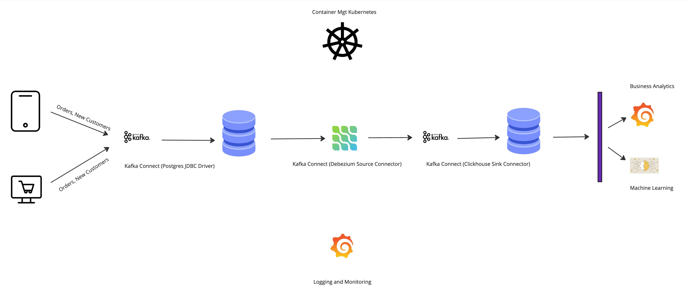

# Realtime Streaming Project

## Overview

This project outlines a highly available real-time data streaming pipeline designed for production deployment. The system processes data produced by users on various devices such as mobiles and computers. It leverages Kafka for stream processing and Debezium for change data capture.

## Table of Contents

- [System Architecture](#system-architecture)
- [Infrastructure](#infrastructure)
  - [Kubernetes](#kubernetes)
  - [Kafka](#kafka)
  - [Debezium](#debezium)
  - [Spark](#spark)
  - [GithubActions](#Github Actions)
- [Visualization](#visualization)
- [Monitoring and Logging](#monitoring-and-logging)
- [System Architecture Diagram](#system-architecture-diagram)

## System Architecture

The system is designed to handle real-time data streams and ensure high availability and fault tolerance. The primary components include:

1. **Data Producers**: Users on mobile devices and computers generate data.
2. **Kafka**: Used for stream processing, ensuring the reliable transmission of data streams.
3. **Debezium**: Utilized for change data capture from databases, making it easier to track and process changes in real-time.
4. **Data Processing**: In production, Apache Spark is recommended for its robust data processing capabilities.
5. **CI/CD**: In production, Apache Spark is recommended for its robust data processing capabilities.

## Infrastructure

### Kubernetes

The entire service is hosted on Kubernetes, providing a scalable and manageable environment for containerized applications. Using a managed Kubernetes service like AWS EKS is recommended for ease of use and reliability.

### Kafka

Kafka is the backbone of our streaming data pipeline, handling the ingestion, buffering, and processing of real-time data streams.

### Debezium

Debezium is used to capture changes in the data, allowing us to process only the new and modified data efficiently.

### Spark

For production environments, Apache Spark is recommended due to its advanced data processing features and scalability.

## Visualization

For data visualization and business analytics, Grafana or Metabase are recommended. Both are open-source platforms that provide powerful visualization capabilities.

## Monitoring and Logging

Grafana is also utilized for monitoring and logging the system. It provides real-time insights and helps in maintaining the health and performance of the data pipeline.

## System Architecture Diagram

---

This document provides a high-level overview of the system architecture and infrastructure considerations for the real-time streaming project. For detailed setup instructions and additional documentation, please refer to README.md.
